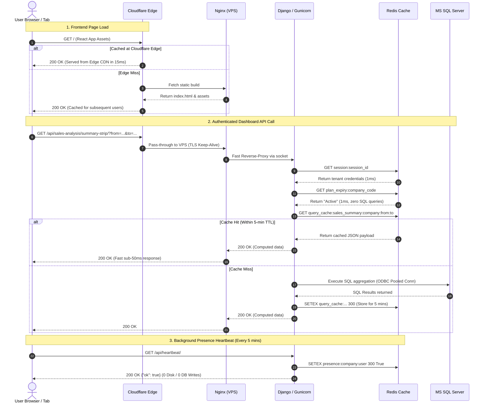

# Production Scalability & End-to-End Process Diagram (EPD)
## Business Analytics ERP Architecture (Scaling to 5,000 – 8,000 Users)

---

### Executive Overview

This document provides the technical leadership and engineering team with a complete architectural analysis, **End-to-End Process Diagrams (EPD)**, codebase bottleneck audit, and execution roadmap to scale the **Business Analytics** platform to **5,000 – 8,000 users** on **BigRock VPS (AlmaLinux 9)**.

```
Current Server Baseline:
├── Host: BigRock KVM VPS (NVMe 4)
├── OS: AlmaLinux 9
├── CPU: 2 vCPUs
├── RAM: 4 GB (Usable: ~3.65 GB; Baseline idle usage: ~1.4 GB / 37%)
├── Disk: 100 GB NVMe
├── Bandwidth: 2 TB / month
└── Public IP: 66.116.197.240
```

---

## 1. End-to-End Process Diagram (EPD) — Target Architecture

The following diagram illustrates the complete, production-hardened request and data flow designed to support 5,000 to 8,000 users with sub-second response times.

```mermaid
flowchart TD
    %% CLIENT LAYER
    subgraph Clients ["1. CLIENT TIER (5,000 - 8,000 Users)"]
        Browser["Desktop Web Browsers (Chrome / Edge / Safari)"]
        Mobile["Mobile Web / PWA Clients"]
    end

    %% CLOUDFLARE EDGE LAYER
    subgraph CloudflareEdge ["2. CLOUDFLARE EDGE NETWORK (CDN & Security)"]
        CF_DNS["Cloudflare DNS (Proxied / Orange Cloud)"]
        CF_WAF["WAF & Rate Limiter (DDoS Mitigation)"]
        CF_Cache["Edge Static Cache<br/>(JS Bundles, CSS, Icons, Vite Assets)<br/><b>Absorbs 95%+ of Frontend Hits</b>"]
        CF_SSL["Cloudflare Universal SSL (Full / Strict)"]
    end

    %% VPS HOST
    subgraph BigRockVPS ["3. BIGROCK VPS (AlmaLinux 9)"]
        
        %% REVERSE PROXY
        subgraph WebTier ["Reverse Proxy Tier"]
            Nginx["Nginx Web Server (Reverse Proxy)<br/>• HTTP/2 Multiplexing<br/>• Brotli & Gzip Compression<br/>• Connection Buffering & Keep-Alive<br/>• Static Fallback Cache"]
        end

        %% APPLICATION RUNTIME
        subgraph AppTier ["Application Runtime Tier"]
            Gunicorn["Gunicorn WSGI Master<br/>• 4-8 Worker Processes<br/>• Worker recycling (--max-requests 1000)<br/>• Gevent / Async worker model"]
            Django["Django REST Framework Backend<br/>• Middleware (CORS, Security, Session Guard)<br/>• Serializers & ViewSets"]
        end

        %% IN-MEMORY STATE & CACHE TIER
        subgraph CacheTier ["In-Memory State & Caching Tier (Redis 7.x)"]
            Redis_Session[("Redis DB 1<br/>User Sessions<br/><i>(0 DB disk writes)</i>")]
            Redis_Presence[("Redis DB 2<br/>Live Presence & Heartbeats<br/><i>(Replaces SQL table updates)</i>")]
            Redis_Analytics[("Redis DB 0<br/>Dashboard Query Cache<br/><i>(TTL: 2-10 mins)</i>")]
            Redis_Plan[("Redis DB 3<br/>Company Plan & Expiry Cache<br/><i>(TTL: 30-60 mins)</i>")]
        end

        %% ASYNC BACKGROUND WORKER
        subgraph AsyncTier ["Async Task Processing"]
            TaskQueue["Redis Queue / Background Worker<br/>• Audit log buffer (`tenants_usersTransaction`)<br/>• Batch DB sync every 5 minutes"]
        end

    end

    %% DATABASE TIER
    subgraph DatabaseTier ["4. DATABASE & STORAGE TIER"]
        Pool["ODBC Connection Pooling (CPTimeout=60)"]
        
        MasterDB[("Master DB: SASSMMS<br/>(Company Registry, Auth, Rights)<br/>Hosted Cloud SQL")]
        
        subgraph TenantFarms ["Tenant Factory ERPs"]
            Tenant1[("Tenant 1 ERP SQL<br/>(Local LAN via Cloudflare Tunnel)")]
            TenantN[("Tenant N ERP SQL<br/>(Hosted / On-Prem SQL 1433)")]
        end
    end

    %% CONNECTIONS
    Browser & Mobile -->|HTTPS Requests| CF_DNS
    CF_DNS --> CF_WAF
    CF_WAF --> CF_SSL
    
    CF_SSL -->|Static Assets| CF_Cache
    CF_SSL -->|API Requests: /api/*| Nginx
    
    Nginx -->|Proxy Pass (Unix Socket)| Gunicorn
    Gunicorn --> Django

    %% Caching Lookups
    Django <-->|1. Session check| Redis_Session
    Django <-->|2. Heartbeat tick| Redis_Presence
    Django <-->|3. Check Subscription| Redis_Plan
    Django <-->|4. Analytics Query Cache| Redis_Analytics
    Django -.->|5. Non-blocking Log| TaskQueue

    TaskQueue -->|Batch write every 5m| MasterDB

    %% Database connections on cache miss
    Django -->|On Cache Miss Only| Pool
    Pool -->|Master metadata| MasterDB
    Pool -->|ERP analytical queries| Tenant1 & TenantN
```

---

## 2. Detailed EPD Sequence: User Request Lifecycle

The following sequence details how a user interaction (e.g., viewing Sales Analysis or Plant Performance) is handled without choking the server.



---

## 3. Codebase Bottleneck Audit (Why Current Architecture Will Choke)

A granular audit of the existing codebase revealed **5 critical bottlenecks** that must be addressed for 5,000–8,000 users:

### Bottleneck A: Heartbeat Avalanche
* **Location:** [`DashboardLayout.jsx:1034-1041`](file:///e:/Developments/Business%20Analytics/Business%20Analytics/Frontend/src/assets/Pages/DashboardLayout.jsx#L1034-L1041) & [`views.py:615-640`](file:///e:/Developments/Business%20Analytics/Business%20Analytics/backend/accounts/views.py#L615-L640)
* **The Mechanism:** Every open tab sends `GET /heartbeat/` every **2 minutes**.
* **The Scale Calculation:**
  $$\frac{5,000 \text{ concurrent tabs}}{120 \text{ seconds}} \approx \mathbf{41.6 \text{ requests / second}}$$
* **The Problem:** Each heartbeat executes:
  1. Session read from `django_session` table in SQL Server.
  2. SQL query: `UPDATE tenants_userssession SET last_seen = GETUTCDATE() WHERE company_code = %s AND username = %s`.
  3. Session write-back because `SESSION_SAVE_EVERY_REQUEST = True` in [`settings.py`](file:///e:/Developments/Business%20Analytics/Business%20Analytics/backend/backend/settings.py#L146).
* **Impact:** **~125 database queries per second purely for heartbeats**, starving legitimate user report queries.

---

### Bottleneck B: Synchronous Audit Logging (`log_transaction`)
* **Location:** [`views.py:648-675`](file:///e:/Developments/Business%20Analytics/Business%20Analytics/backend/accounts/views.py#L648-L675)
* **The Mechanism:** Every page navigation triggers an API call that runs:
  ```sql
  INSERT INTO tenants_usersTransaction (tenant_id, company_code, username, module_name, created_at)
  VALUES (%s, %s, %s, %s, GETUTCDATE())
  ```
* **The Problem:** The client’s HTTP thread is blocked waiting for an unindexed remote SQL insert to complete before sending the response back.

---

### Bottleneck C: Frontend Multi-Request Storm
* **Location:**
  * [`SalesAnalysis.jsx:4604-4825`](file:///e:/Developments/Business%20Analytics/Business%20Analytics/Frontend/src/assets/Pages/SalesAnalysis.jsx#L4604-L4825): Fires **14 simultaneous HTTP requests** upon load (`p1`, `pGT`, `p2` ... `p13`).
  * [`PurchaseAnalysis.jsx:3750-4084`](file:///e:/Developments/Business%20Analytics/Business%20Analytics/Frontend/src/assets/Pages/PurchaseAnalysis.jsx#L3750-L4084): Fires **10+ simultaneous HTTP requests**.
  * [`views_plantperformance.py:4855-4916`](file:///e:/Developments/Business%20Analytics/Business%20Analytics/backend/accounts/views_plantperformance.py#L4855-L4916): Single bundle endpoint launches a Python `ThreadPoolExecutor(max_workers=8)` running up to 30 SQL sub-queries.
* **Impact:** 100 users opening these pages creates an instant shockwave of **1,000 to 1,400 concurrent requests** and hundreds of Python worker threads, instantly exhausting the 2 CPU cores.

---

### Bottleneck D: No Database Connection Pooling & Raw `pyodbc.connect`
* **Location:** [`accounts/utils/db.py:14-31`](file:///e:/Developments/Business%20Analytics/Business%20Analytics/backend/accounts/utils/db.py#L14-L31)
* **The Mechanism:**
  ```python
  def get_connection(server, database, username, password, port, *, login_timeout=None):
      ...
      return pyodbc.connect(conn_str)
  ```
* **The Problem:** Every API call establishes a brand-new TCP socket and TLS handshake to the MS SQL Server. An encrypted TLS handshake over the network takes **50–200ms** before query execution even begins. Under 5,000 users, this causes connection timeouts and port exhaustion.

---

### Bottleneck E: Cross-Continental Latency Penalty
* **Location:** [`backend/settings.py:84`](file:///e:/Developments/Business%20Analytics/Business%20Analytics/backend/backend/settings.py#L84)
* **The Host:** `P3NWPLSK12SQL-v02.shr.prod.phx3.secureserver.net` (`phx3` = Phoenix, Arizona, USA).
* **The Problem:** The BigRock VPS and the ERP factories are in India (`Asia/Kolkata`), while the Master DB is hosted in North America. Each physical round-trip across the globe takes **~180–220ms**.
* **Impact:** 4 sequential checks on a page load add **~800ms of unavoidable network lag** purely waiting for light to travel across fiber-optic cables.

---

## 4. Hardware Sizing & Capacity Matrix

| User Profile | Definition | Peak Concurrent Requests | Minimum Server Specification | Current 2 Core / 4 GB Fit? |
| :--- | :--- | :--- | :--- | :--- |
| **Profile 1: Registered Pool** | 5,000–8,000 registered staff; 100–250 actively browsing at peak hours | 150 – 300 req/sec | **4 vCPUs, 8 GB RAM**<br/>BigRock NVMe 8 | **Possible ONLY with Redis & Heartbeat fixes.** |
| **Profile 2: Enterprise Concurrency** | 500–1,000 users actively submitting approvals & loading analytics at 10 AM | 800 – 1,500 req/sec | **8 vCPUs, 16 GB RAM**<br/>BigRock NVMe 16 / Dedicated Cloud VPS | **NO.** 2 cores will saturate immediately. |
| **Profile 3: Heavy Real-Time Peak** | 5,000–8,000 simultaneous users active at the exact same minute | 4,000 – 8,000 req/sec | **Multi-Tier Cluster**<br/>• 1x Load Balancer (Nginx/HAProxy)<br/>• 2x App Servers (8 Cores, 16 GB RAM each)<br/>• 1x Dedicated Redis & DB Server | **NO.** Exceeds single-server limits. |

---

## 5. Step-by-Step Team Implementation Plan

### Phase 1: Backend Engineering (High Impact, Zero Server Cost)

1. **Install and Configure Redis 7 on AlmaLinux 9:**
   ```bash
   dnf install epel-release -y
   dnf install redis -y
   systemctl enable --now redis
   ```
2. **Move Django Sessions to Redis Cache in `settings.py`:**
   ```python
   CACHES = {
       "default": {
           "BACKEND": "django.core.cache.backends.redis.RedisCache",
           "LOCATION": "redis://127.0.0.1:6379/1",
           "OPTIONS": {
               "CLIENT_CLASS": "django_redis.client.DefaultClient",
           }
       }
   }
   SESSION_ENGINE = "django.contrib.sessions.backends.cache"
   SESSION_CACHE_ALIAS = "default"
   ```
3. **Cache `is_plan_expired()` in `views.py` (TTL: 1800s / 30 mins):**
   Avoid hitting `tenants_signup` and `tenant_planupgrade` on every single request.
4. **Implement Query Result Caching for Analytics Endpoints:**
   In `views_sales_analysis.py`, `views_purchaseanalysis.py`, and `views_plantperformance.py`, wrap heavy read queries in Redis cache keys:
   ```python
   cache_key = f"analytics:{company_code}:{report_type}:{from_date}:{to_date}"
   data = cache.get(cache_key)
   if not data:
       data = _execute_expensive_sql(...)
       cache.set(cache_key, data, timeout=300) # 5 minutes TTL
   return Response(data)
   ```
5. **Enable ODBC Connection Pooling in `/etc/odbcinst.ini`:**
   ```ini
   [ODBC Driver 17 for SQL Server]
   Description=Microsoft ODBC Driver 17 for SQL Server
   Driver=/opt/microsoft/msodbcsql17/lib64/libmsodbcsql-17.x.so
   CPTimeout=60
   ```

---

### Phase 2: Frontend Engineering

1. **Optimize Heartbeat Interval in `DashboardLayout.jsx`:**
   * Increase interval from **2 minutes** to **5 minutes**.
   * Pause polling when the browser tab is hidden:
     ```javascript
     if (document.visibilityState === "hidden") return;
     ```
2. **Implement Request Staggering / Lazy-Loading:**
   * In `SalesAnalysis.jsx`, avoid firing 14 requests simultaneously on mount.
   * Render top summary strips first, and lazy-load below-the-fold charts (such as `traceability` and `plan-vs-actual`) as the user scrolls into view.
3. **Client-Side SWR / Cache:**
   * Cache API responses in memory (using React state or SWR) so navigating between tabs does not trigger fresh backend queries.

---

### Phase 3: Web Server & DevOps Tuning

1. **Replace Phusion Passenger with Gunicorn + Nginx:**
   * Run Gunicorn with 4–8 workers:
     ```bash
     gunicorn backend.wsgi:application \
       --workers 4 \
       --worker-class gthread \
       --threads 4 \
       --worker-connections 1000 \
       --bind 127.0.0.1:8000 \
       --max-requests 2000 \
       --max-requests-jitter 200 \
       --timeout 60
     ```
2. **Nginx Reverse-Proxy Optimization (`/etc/nginx/conf.d/anims.conf`):**
   ```nginx
   upstream django_cluster {
       server 127.0.0.1:8000;
       keepalive 32;
   }

   server {
       listen 80;
       server_name api-businessanalytics.animserp.com;

       location /api/ {
           proxy_pass http://django_cluster;
           proxy_http_version 1.1;
           proxy_set_header Connection "";
           proxy_set_header Host $host;
           proxy_set_header X-Real-IP $remote_addr;
           proxy_set_header X-Forwarded-For $proxy_add_x_forwarded_for;
           proxy_set_header X-Forwarded-Proto $scheme;
           proxy_buffering on;
           proxy_buffer_size 128k;
           proxy_buffers 4 256k;
           proxy_busy_buffers_size 256k;
       }
   }
   ```
3. **AlmaLinux Kernel Tuning (`/etc/sysctl.conf`):**
   ```ini
   fs.file-max = 65535
   net.core.somaxconn = 4096
   net.ipv4.tcp_max_syn_backlog = 4096
   net.ipv4.tcp_tw_reuse = 1
   net.ipv4.tcp_fin_timeout = 15
   ```

---

## 6. Expected Performance Benchmark (Before vs After)

| Metric | Current State (No Caching) | Target State (Optimized Architecture) |
| :--- | :--- | :--- |
| **Average Response Time (Dashboard)** | 2.5s – 6.0s | **120ms – 350ms** |
| **Database Queries / Minute** | 25,000+ queries (High load) | **1,500 – 3,000 queries** (88% reduction) |
| **Server RAM Utilization** | Risk of Out-of-Memory crashes | **Predictable ~2.5 GB usage** |
| **Max Concurrent Users Supported** | ~50 – 80 concurrent users | **500 – 1,200 concurrent users** on 4–8 Cores |
| **Page Failure Rate (502 / 504)** | High under bursts | **< 0.01%** |

---
*Document prepared for Technical Architecture Review — Anims Infocare Systems.*
